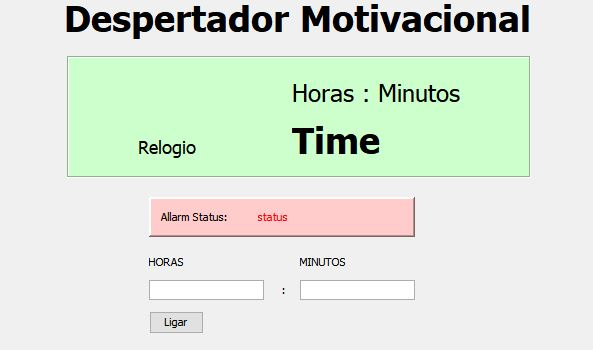

# akihitto_Despertador
Repositório para o projeto de um aplicativo para despertador com várias funcionalidades

O objetivo do projeto é fazer um despertador mais eficiente para me acordar no dia a dia com mais funções que um simples despertador.

Esse despertador terá as funções de toque em determinado horário com a música escolhida, ligar a lanterna ao tocar o despertador, e ser capaz de reproduzir um video.

Para fazer esse projeto pensei em fazer um programa em Java.

## Utilizando o Programa:

Requisitos: ter o JRE do java para executar o arquivo(para baixa-lo procure no google)

1) Em "Projeto Despertador\ProjetoAlarme\dist" clique no arquivo ProjetoAlarme.jar

2)Coloque a hora que quer ser acordado e clique em "Ligar"

3)Espere até a hora programada

Obs: Os códigos estão na pasta "rsc"

## Tutorial GUI Swing Java
O tutorial escolhido encontra-se no youtube e refere-se a interface gráfica do Java. link:https://www.youtube.com/watch?v=sTX0UEplF54&list=PLHz_AreHm4dkI2ZdjTwZA4mPMxWTfNSpR

## Esboço GUI

