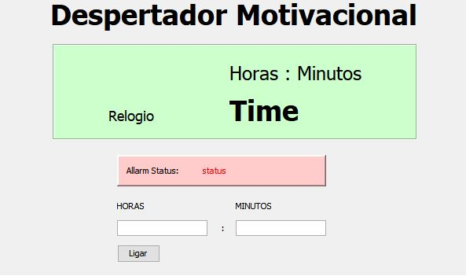
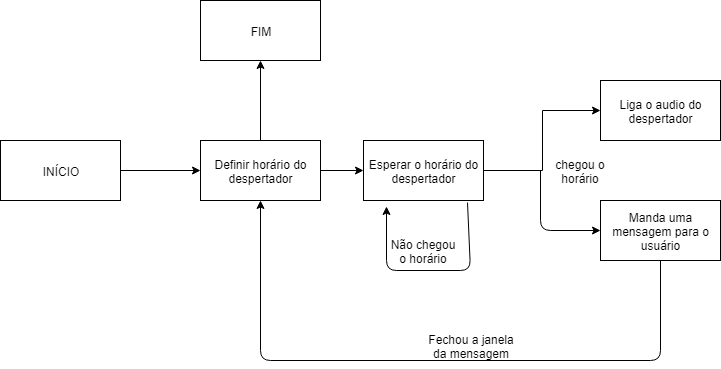
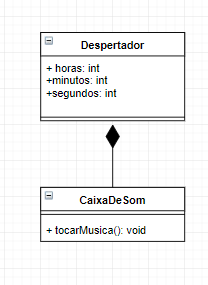

# akihitto_Despertador
Repositório para o projeto de um software de um despertador, Para fazer esse projeto pensei em fazer um programa em Java.

## Conceito
O projeto consiste na implementação de um software para despertar mais eficiente para me acordar no dia a dia.

## Função
Esse despertador terá a função de toque em determinado horário que o usuário escolha.

## Motivação
Eu tenho dificuldade em acordar cedo todos os dias de manhã para ir para o IME, logo, com esse despertador vou criar um mecanismo para me acordar com mais eficiência.

## Utilizando o Programa:

Requisitos: ter o JRE do java para executar o arquivo(para baixa-lo procure no google)

1)Em "Projeto Despertador\ProjetoAlarme\dist" clique no arquivo ProjetoAlarme.jar

2)Coloque a hora que quer ser acordado e clique em "Ligar"

3)Espere até a hora programada

Obs: Os códigos estão na pasta "src" que contêm

AlarmClock.java //codigo principal, onde tem a public static void main(String args[])

CaixaDeSom.java //codigo que contem a classe CaixaDeSom, na qual faz ter som no programa.

Despertador.java //codigo que contem a classe Despertador.

## Tutorial GUI Swing Java
O tutorial escolhido encontra-se no youtube e refere-se a interface gráfica do Java. link:https://www.youtube.com/watch?v=cYMruFKwqf0&index=10&list=PLHz_AreHm4dkI2ZdjTwZA4mPMxWTfNSpR

## Esboço GUI

## Fluxograma

## Diagrama de Classes

